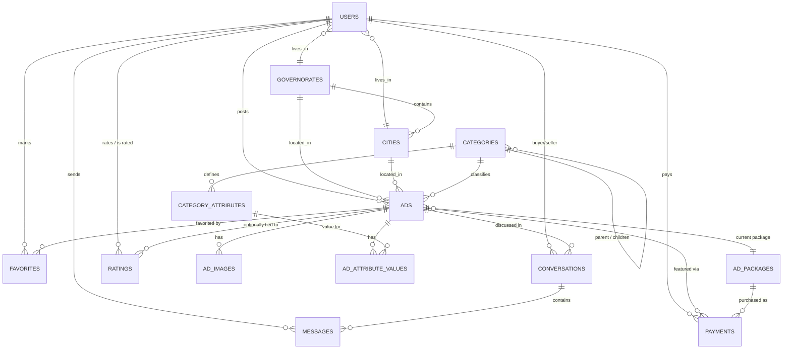

# Database Schema — Aveno Marketplace

Source of truth is `database/migrations/*`. This is the human-readable map, kept in sync with them.

## Table notes

**users** — `phone` is the primary login identifier (Syrian numbers), `password` hashed via Sanctum + `Hash`. `rating_average`/`rating_count` are denormalized (recomputed whenever a `Rating` is written — see the TODO in `RatingController@store`) so the profile screen doesn't have to aggregate on every read. Soft-deletable.

**governorates / cities** — two-level geo tree (proposal §2 "الفلترة والبحث حسب المدينة أو المحافظة"). Seeded with Syria's 14 governorates in `GeoSeeder`.

**categories** — self-referencing (`parent_id`) so subcategories are free (e.g. سيارات ▸ سيارات كهربائية) without a migration. `slug` is the stable machine key the Flutter app can route on.

**category_attributes** — the "dynamic specs per category" from the proposal (§1/§2: "كل فئة تمتلك خصائصها الخاصة"). `type` (`text|number|boolean|select|multiselect`) tells the client how to render the field and the backend how to validate it; `options` is a JSON array of choices for `select`/`multiselect`. This is what lets Aveno Code add a whole new category from the admin panel with zero code changes.

**ads** — the listing itself. `status` (`pending|approved|rejected|expired|sold`) drives the review workflow — every new ad starts `pending` and only becomes visible on the public feed once an admin approves it. `is_featured` + `ad_package_id` + `featured_until` implement the paid boost; `reviewed_by`/`reviewed_at`/`rejection_reason` give the admin panel a full audit trail. Soft-deletable.

**ad_attribute_values** — EAV table: one row per `(ad, category_attribute)` pair, holding the actual value. Keeps `ads` schema-stable no matter how many categories/specs exist.

**ad_images** — ordered gallery per ad, one flagged `is_cover`.

**ad_packages** — the 15/30/60-day boost catalog (proposal §2/§3), price editable without a deploy.

**favorites** — simple `(user, ad)` pivot, unique pair.

**conversations / messages** — one conversation per `(ad, buyer)`; `seller_id` is denormalized onto the conversation so both sides can be queried without joining through `ads`. MVP is polling-based (`GET .../messages`); swappable for Laravel broadcasting later without touching the contract.

**ratings** — `(rater, rated, ad)` unique triple, so a buyer/seller pair can rate each other once per transaction; `ad_id` is nullable for a general rating not tied to one deal.

**payments** — one row per Sham Cash checkout attempt. `provider_reference` is Sham Cash's own transaction id, used to match the incoming webhook back to this row. `raw_response` keeps the full gateway payload for support/debugging.

**Spatie `roles` / `model_has_roles` / …** — only the `admin` role is used right now (gates every `admin/*` route). Swap to fine-grained permissions later if the admin team grows past one role.

## Deliberately deferred to Phase 2 (proposal §9 "الخدمات المستقبلية")

No tables yet for: ad view/contact statistics beyond `views_count`, "Verified Seller" badge, similar-ads, full ad edit history, in-app wallet / P2P payment, job postings. Add these as new tables + migrations when that phase starts — nothing above needs to change to support them.
