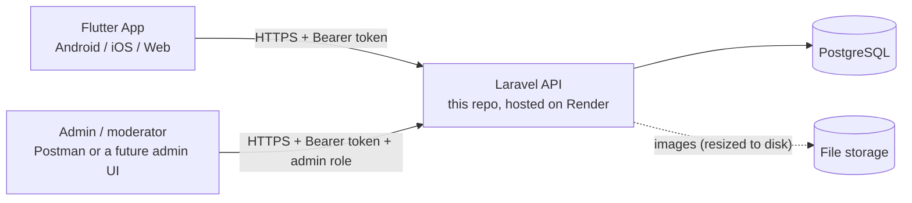

# How Aveno Marketplace Works

This is the product-level walkthrough: what the app does, screen by screen, and which backend pieces make each screen work. If you're wiring up the Flutter app, read this first to understand the *flow*, then go to [`API_REFERENCE.md`](API_REFERENCE.md) for the exact request/response shape of any endpoint it mentions.

## The big picture

There is **no server-rendered website and no built admin dashboard** — this repo is a pure JSON API. Every screen, including the admin side, is just a client sending HTTP requests and rendering the response. Right now the only client is the Flutter app (and Postman, for testing); an admin panel is a separate possible future client, not something this repo serves.

One account type, two roles: every person is a `User` row. Nothing structurally separates "buyer" from "seller" — anyone can browse, post an ad, message, and rate. The only special role is **`admin`** (granted via Spatie permissions), which unlocks the moderation endpoints under `/admin/*`.

---

## 1. Sign Up

**Screen:** registration form (name, phone, password, optionally email + home governorate/city).
**Call:** `POST /auth/register`
**What happens:** a `User` row is created, the password is hashed, and the app gets back a usable Sanctum **token immediately** — there's no separate "verify your account" or "log in after registering" step. Store that token (securely — `flutter_secure_storage`, not plain prefs) and attach it as `Authorization: Bearer <token>` on every call from here on.

`phone` is the unique login identifier, not email (email is optional, mainly for future password-reset flows that aren't built yet).

---

## 2. Log In

**Screen:** login form (phone + password).
**Call:** `POST /auth/login`
**What happens:**
- Wrong phone/password → `422` with `"بيانات الدخول غير صحيحة"`.
- **Banned account** → `403` with `"تم إيقاف هذا الحساب"`. The Flutter app should show this message as a popup/dialog, not treat it like a generic error — that's the signal to tell the user their account was suspended and they need to contact support/wait for an admin to lift it.
- Otherwise → same `{user, token}` shape as register.

Once banned, a user is locked out **immediately**, not just on their next login — if they already had a token from before the ban, the admin's ban action revokes every one of that user's tokens at the moment of banning, so any screen they have open will start getting `401`s right away.

---

## 3. Home Page

**Screen:** category grid + a sponsored-banner carousel (§15) + a scrollable feed of ads.
**Calls:**
- `GET /categories` — top-level categories (سيارات / عقارات / دراجات نارية) with their subcategories, for the grid.
- `GET /ads` — the public feed. Only ever returns `status = approved` ads; featured ads (paid boost, see §10) sort first, then newest first.

This is the one endpoint in the whole API that's deliberately simple with no params — just "show me what's live," paginated 20 at a time.

---

## 4. Search & Filters

**Screen:** same feed as the home page, but with a search bar, a sort dropdown, and a filter sheet (price range, location, category-specific specs like fuel type or number of rooms).
**Call:** still `GET /ads`, now with query params:

| Param | Does |
|---|---|
| `q` | free-text match against title/description |
| `category_id`, `governorate_id`, `city_id` | exact-match dropdowns |
| `min_price`, `max_price` | range slider |
| `sort` | the "Sort" dropdown: `newest` (default — featured first, then newest), `price_asc`, `price_desc`, `popular` (most-viewed first), or `nearest` (needs `lat`/`lng` — see below) |
| `lat`, `lng` | the device's current coordinates — required only when `sort=nearest`; this is also the building block for a "Popular near you" home-screen section (e.g. call `GET /ads?sort=popular&city_id=<the user's city>`, or `sort=nearest` with real GPS coordinates for true proximity) |
| any dynamic attribute key (e.g. `fuel_type=بنزين`) | category-specific filter chips — see §6 for where these keys come from |

There's no separate "search" endpoint — search is just `GET /ads` with `q` set, same pagination and same response shape as browsing. The Flutter app can reuse one feed widget for "home," "search results," "filtered browse," and a "popular near you" rail.

One thing to get right in the UI: picking a `sort` value other than `newest` **replaces** the normal featured-first ordering, it doesn't add to it — e.g. `sort=price_asc` is a flat price-ascending list, a featured ad doesn't get pinned to the top of it.

---

## 5. Ad Detail Page

**Screen:** full ad view — photo gallery, price, description, dynamic specs, seller card, "message seller" / "favorite" / "rate seller" buttons.
**Call:** `GET /ads/{id}`
**What happens:** this is the *only* ads endpoint that includes `description`, the dynamic `attributes` array, and the seller's `user` info — the feed deliberately omits these to keep list responses light. Every call also increments `views_count` (no dedup — refreshing counts again, intentionally simple).

**Important rule, same everywhere it applies:** an ad that isn't `approved` yet (still pending review, or rejected) is invisible to everyone except its own owner — `GET /ads/{id}` 404s for it, and so do favoriting and starting a chat about it (§7, §8). The only way the owner sees their own pending/rejected ad is through "My Ads" (§9), not this endpoint.

---

## 6. Posting a New Ad

**Screen:** multi-step "post an ad" form: pick a category → fill category-specific fields → add photos → review → submit.
**Calls, in order:**
1. `GET /categories/{id}` once a category is picked — returns that category's `attributes` array (e.g. cars has `condition`, `fuel_type`, `year`, `mileage_km`), each with a `type` (`text|number|boolean|select|multiselect`), `options` for selects, and `is_required`. **This is how the form knows which fields to render** — it's fully data-driven, not hardcoded per category in the Flutter app.
2. `POST /ads` (multipart, since it carries files) — category/location/title/description/price + `attributes[<key>]=<value>` for each dynamic field + `images[]` (1–12 files, each ≤5MB).

**What happens server-side:** every uploaded image is resized (max 1600×1600) and re-compressed to JPEG before storage — a phone photo that's 8MB comes out a few hundred KB. The ad is created as `status = pending` — **it is not visible to anyone but its owner until an admin approves it** (§11). This is the single most important state in the whole app to get right in the UI: right after posting, the user should see their ad in "My Ads" marked as pending, not assume it's live.

If this is a category Aveno Code wants to add in the future (e.g. "furniture"), it's a data entry in the admin side, not a code change or an app update — that's the whole point of the dynamic-attributes design.

---

## 7. Editing an Ad / Managing Photos

**Screen:** "edit ad" from My Ads.
**Calls:**
- `PUT/PATCH /ads/{id}` — partial update of title/description/price/attributes.
- `POST /ads/{id}/images` — add more photos (multipart, appends to the existing gallery, up to 12 total).
- `DELETE /ads/{id}/images/{imageId}` — remove one photo. An ad must always keep at least one — removing the last one is rejected; delete the whole ad instead if that's the goal.

**Any edit — text, attributes, or photos — resets the ad back to `pending`** and clears any previous rejection reason. This is deliberate: an admin already reviewed the old version; the new version needs its own look. The UI should make this visible (e.g. a "resubmitted for review" toast), not silent.

---

## 8. My Ads / Account Page

**Screen:** "My Ads" tab — the user's own listings in every status, so they can see "pending review," "live," or "rejected: <reason>."
**Call:** `GET /my/ads` — unlike the public feed, this returns the caller's ads **regardless of status**, which is exactly what makes it the right endpoint for this screen and wrong for the home feed.

**Screen:** Account/Profile — the user's own info plus their rating.
**Call:** `GET /auth/me` — includes `rating_average` and `rating_count`, which update automatically whenever someone rates this user (§10) — no separate "refresh my rating" call needed, just re-fetch `me` after a rating event or on screen focus.

---

## 9. Favorites

**Screen:** heart icon on any ad card/detail; a dedicated "Saved" tab.
**Calls:** `GET /favorites` (list), `POST /ads/{id}/favorite` (save), `DELETE /ads/{id}/favorite` (unsave).
Saving is idempotent (tapping twice doesn't duplicate), and — same rule as §5 — you can't favorite an ad that isn't approved.

---

## 10. Chat

**Screen:** "Message Seller" button on an ad → conversation thread → conversations list ("Inbox" tab).
**Calls:**
- `POST /ads/{id}/conversations` — starts (or returns the existing) conversation with that ad's owner. The caller becomes the buyer; you can't message yourself about your own ad; and — same rule again — you can't message about a non-approved ad.
- `GET /conversations` — the inbox: every conversation the caller is in, as either side.
- `GET /conversations/{id}/messages` / `POST /conversations/{id}/messages` — the thread itself.

**This is polling, not push/websockets.** The Flutter app should refetch `/messages` every few seconds while a chat screen is open (e.g. a timer or `Stream.periodic`). Sending a message also fires a notification (§12) to the other participant, so the inbox badge can update even when they're not actively on the chat screen.

---

## 11. Ratings

**Screen:** "Rate this seller" from an ad or from their profile; a list of reviews on the seller's profile.
**Calls:** `GET /users/{id}/ratings` (public list), `POST /users/{id}/ratings` (`score` 1–5, optional `comment`, optional `ad_id`).

Deliberately loose rule here: **no proof of an actual purchase or conversation is required** — any ad the rater could plausibly have seen (i.e., any approved ad) is a valid reference, or `ad_id` can be omitted entirely for a general rating. Rating the same person again (same `ad_id`, including both omitted) updates the existing rating instead of creating a duplicate, and the target's `rating_average`/`rating_count` recompute immediately — which is what makes it show up on their profile/account page (§8) right away.

---

## 12. Notifications

**Screen:** a bell icon with an unread badge, and a notifications list.
**Calls:** `GET /notifications`, `POST /notifications/{id}/read`, `POST /notifications/read-all`.

Four events fire a notification automatically — nothing else does, there's no generic "notify" endpoint:

| `type` in the response | Fires when |
|---|---|
| `ad_approved` | an admin approves your ad |
| `ad_rejected` | an admin rejects your ad (includes the reason) |
| `new_message` | someone messages you |
| `new_rating` | someone rates you |

These are in-app only right now (stored in the DB, fetched by polling `GET /notifications`) — there's no push notification (FCM/APNs) wired up yet, so don't expect a notification to arrive while the app is closed.

---

## 13. Featured Ads / Payments — **not finished yet**

**Screen (planned):** "Boost this ad" → pick a 15/30/60-day package → pay via Sham Cash → ad gets a "featured" badge and sorts first on the home feed.
**Calls:** `GET /ad-packages` (works — returns the real catalog) → `POST /ads/{id}/checkout` → **always returns `501 Not Implemented`** right now. The webhook that would mark payment complete (`POST /payments/shamcash/webhook`) is also a stub. This is waiting on real Sham Cash API credentials/docs — don't build this screen's "payment" step yet, or build it behind a feature flag, since the backend will reject it.

---

## 14. The Admin Side

**There's a real admin panel now** — a small server-rendered web UI at `/admin-panel` (login at `/admin-panel/login`), separate from the Flutter-facing JSON API. It's session-based (the Laravel `web` guard + a login form), not Sanctum bearer tokens — an admin opens it in a browser, logs in with their phone + password, and gets cookie-based sessions from there. Log in with the seeded admin account (`DatabaseSeeder` → `AdminUserSeeder`: phone `0999999999`, password = the server's `ADMIN_PASSWORD` setting, re-applied on every deploy — there is no default password) or any user who has the `admin` role. Failed logins are rate-limited (5 a minute per phone + IP). Access is re-checked on every request, not just at login: removing someone's `admin` role, or banning them, ends their open panel session on their next click. The panel's session cookie only works for the panel — it is never accepted by `/api/*`, which stays bearer-token only. The cookie is marked Secure whenever the panel is reached over https. The underlying `/admin/*` JSON endpoints below still exist too (useful for Postman/automation) — the panel is a second client of the same rules, not a replacement for the API.

What's in it, each gated by the `admin` role on top of normal auth:

- **Moderate the ad queue** (`/admin-panel/ads`, or `GET/POST /admin/ads...`) — filter by status, approve with one click, or reject with a reason (becomes the `ad_rejected` notification the owner sees, push included). This is the only way an ad ever becomes publicly visible. Only a **pending** ad can be approved (a sold/expired ad goes through relist, a rejected one through an owner edit — both put it back to pending first). Rejecting works on a pending ad or a publicly visible one (**approved** or **sold**) — that's how a live ad gets taken down, e.g. after a report. A decision that no longer applies (a stale tab, a second admin, a double-click) is refused instead of applied twice, so the owner is never notified twice.
- **Manage users** (`/admin-panel/users`, or `/admin/users...`) — search, ban/unban. Banning instantly revokes the user's tokens (§2), removes their push device tokens, and is blocked entirely against another admin account — there's no way to ban (or accidentally self-ban) an admin through this.
- **Manage categories** (`/admin-panel/categories`, or `/admin/categories...`) — create categories and add dynamic spec fields to them. This is exactly the mechanism from §6 — adding "trunk capacity" to the cars category is a form submission, not a deploy. A field's key must be snake_case (`trunk_capacity` — it becomes a filter query param), unique within its category, and not one of the feed's own params (`sort`, `q`, `page`, ...). A select/multiselect needs at least one option; in the panel they're typed comma-separated, with either `,` or the Arabic `،`. New fields are filterable unless that box is unticked.
- **Manage banners** (`/admin-panel/banners`, or `/admin/banners...`) — create/pause/resume/delete sponsored banners (§15) with an actual image upload form, instead of needing Postman for something as simple as a file upload.
- **Review reports** (`/admin-panel/reports`, or `/admin/reports...`) — see what's been flagged (§16) and mark it resolved or dismissed. Follow-up happens on the other tabs: ban the user, or reject the ad from the Ads tab's "Approved" filter.

---

## 15. Sponsored Banners (Home Screen)

**Screen:** a banner carousel on the home screen (§3) — separate from the ads feed. This is for businesses who pay the admin **directly, outside the app** (e.g. a restaurant hands the admin money or pays via Sham Cash as a side deal, not through `/ads/{id}/checkout`) to get their image displayed for an agreed window.

**Calls:**
- `GET /banners` — public, unauthenticated. Returns only banners currently inside their admin-set `starts_at`/`ends_at` window **and** not paused — this is exactly what the home-screen carousel should render, in `sort_order`.
- Everything else is admin-only (`/admin/banners`): `GET` to list every banner regardless of status (the admin's own management view), `POST` to create one (multipart — `image`, optional `title`, optional `link_url`, `starts_at`, `ends_at`, optional `sort_order`), `PUT/PATCH /admin/banners/{id}` to edit fields or flip `is_active` (pausing a banner early without touching its dates), `DELETE` to remove one (also deletes its image file).

**How tapping a banner behaves:** `link_url` can be a normal `https://...` link or a `tel:+963...` number — the Flutter app opens whichever it is with `url_launcher`, same call either way. It can also be left blank for a purely visual banner. Any other scheme (e.g. `javascript:`) is rejected server-side — not a real use case and a good thing to block regardless.

**What this is *not*:** there's no in-app payment flow for banners, unlike the ad-boost packages in §13 — the admin is trusted to have actually been paid before creating one. If that ever needs to change (e.g. tracking banner revenue in-app), it'd reuse the same `Payment` model from §13 rather than inventing a second one.

## 16. Reporting

**Screen:** a "Report" action on an ad or a user profile — spam, scam, inappropriate content, or other.
**Calls:** `POST /ads/{id}/report` / `POST /users/{id}/report`, body `{reason, details?}` where `reason` is one of `spam|inappropriate|scam|other`. You can't report your own ad or yourself. Reporting the same target again updates and reopens your existing report rather than creating a duplicate — so escalating with new details, or re-flagging something that was dismissed, both just work.

This **never takes action by itself** — no auto-ban, no auto-unlist. It only queues something onto the admin's Reports tab (§14) for a human to look at; any follow-up (banning the user, rejecting the ad) is a separate, deliberate admin action.

---

## Seller Tools: Analytics, Sold, Relist, Similar Ads

A few smaller pieces that round out the seller experience, all added onto existing endpoints rather than new screens:

- **Seller stats** — `GET /my/ads/stats` returns aggregate numbers across all of a seller's ads (counts by status, total views, total favorites, total conversations) — the data for a simple "your activity" dashboard card. Per-ad numbers (`favorites_count`, `conversations_count`) are also on individual ads returned from `GET /my/ads` and `GET /ads/{id}` — `views_count` was already there, just never had company.
- **Mark as sold / relist** — `POST /ads/{id}/mark-sold` takes an approved ad off the public feed (it's not deleted — `GET /ads/{id}` still shows it, for closure, just with a `sold` badge) and `POST /ads/{id}/relist` sends a sold/expired ad back through the normal review queue to make it live again.
- **Similar ads** — `GET /ads/{id}/similar` for a "you might also like" rail on the detail page: same category, price within ±30% when the ad has one, closest price first.

---

## Known gaps (so nobody builds against something that isn't there)

- **Sham Cash payments are stubbed** (§13) — `501` on checkout, no real money flow yet.
- **Push notifications and S3/R2 image storage are code-complete but need an external account to actually turn on** — both silently no-op without credentials (the same pattern as Sham Cash), so nothing breaks by leaving them off, but nothing happens either until `FIREBASE_CREDENTIALS_JSON` (push) or `FILESYSTEM_DISK=s3` + `AWS_*` (persistent image storage, e.g. Cloudflare R2) are actually set. Until then, in-app/polling notifications (§12) and local-disk images both still work exactly as before.
- **Sentry error tracking is wired in but inactive** without a `SENTRY_LARAVEL_DSN` — free to sign up for when you want it.
- **The queue worker has no supervisor** — it's a second process backgrounded inside the same container as the web server (Render's free tier has no separate worker-service type), so it dies silently with the container rather than being restarted on its own if it crashes. Acceptable for this scale; revisit before relying on it for anything time-sensitive.

## Where to go next

- [`API_REFERENCE.md`](API_REFERENCE.md) — every endpoint's exact fields, response shape, and error codes, with real examples.
- [`Aveno_Marketplace.postman_collection.json`](Aveno_Marketplace.postman_collection.json) — click-to-test version of every call mentioned above, already pointed at the live deployment.
- [`ERD.md`](ERD.md) — the data model behind all of this, if you need to understand how tables relate.
- [`API_CONTRACT.md`](API_CONTRACT.md) — the short route-level contract the Flutter team builds against; update it in the same commit as any backend change that touches a route, field, or status code.
